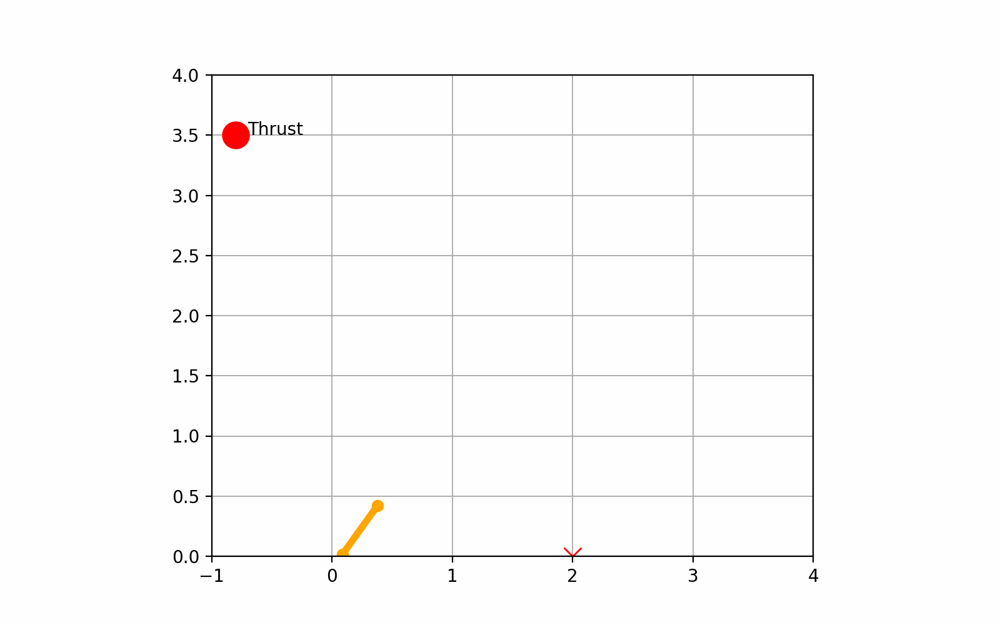

## Mission
We have a drone in 2D space with coordinate of $x_0$, and
$z_0$, and the velocity angle as $\theta_
0.$ What kind of
velocity should it have to reach the target position $x_{t1}$ and $z_{t1}$ passively considering gravity?
What kind of attack angle should the drone have when
touch ground, considering that there is a spring with
stiffness k and length l, in order to reach the next goal($x_{t2}$ and $z_{t2}$) following $x_{t1}$ and $z_{t1}$ passively?
In the meantime, the point has some rotational inertia as J. So what kind of angle and angular velocity should the
drone have to reach the attack angle in previous step?

The whole process can be seen as 

---

## Decision
1. We change our dimension to 6 []

2. The hopper may NOT land perfectly even if analytic formulas predict it. So we decide keep the lander reward for `pos_error`. 

3. Restraint condition:
- velocity to get the target basec on theta and the target point
$$v_o = \sqrt{\frac{g(x_1-x_0)^2}{2cos^2 \theta_0((x_1-x_0)-(z_1-z_0))}}$$
- Time to target:
$$t^* = \frac{\Delta_X}{v_0cos\theta_0}$$

4. td is for touchdown

$$v_{req\_x} = \frac{\Delta x}{t^*}$$
$$v_{req\_y} = (\Delta z + 0.5 g (t^*)^2) / t^*$$

5. Process Breakdown:
- Initial phase (Active): The robot is in a random state in the air. The model needs to control the thrust and torque to quickly adjust its position ($x, z$), velocity ($v$), and angle ($\theta$) to satisfy the "perfect ballistic formula".
- Once the state satisfies the formula ($v_{actual} \approx v_{req}$), the main thrust is turned off (Thrust=0), and the vehicle enters gliding mode.
- When approaching the target, we still need to turn on thrust to check the altitude.

6. Allows for fine-tuning of up to 20% of thrust out of $R^2$

## Result 

## Advise Dec 11
1. PPO just control hopper to get the area ($r^2<pos<R^2$ and $30<angle<60$) 
2. 
