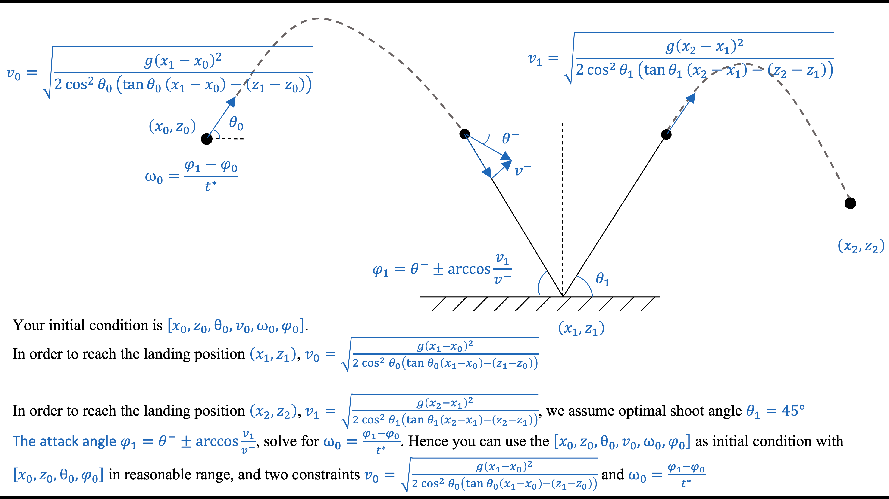
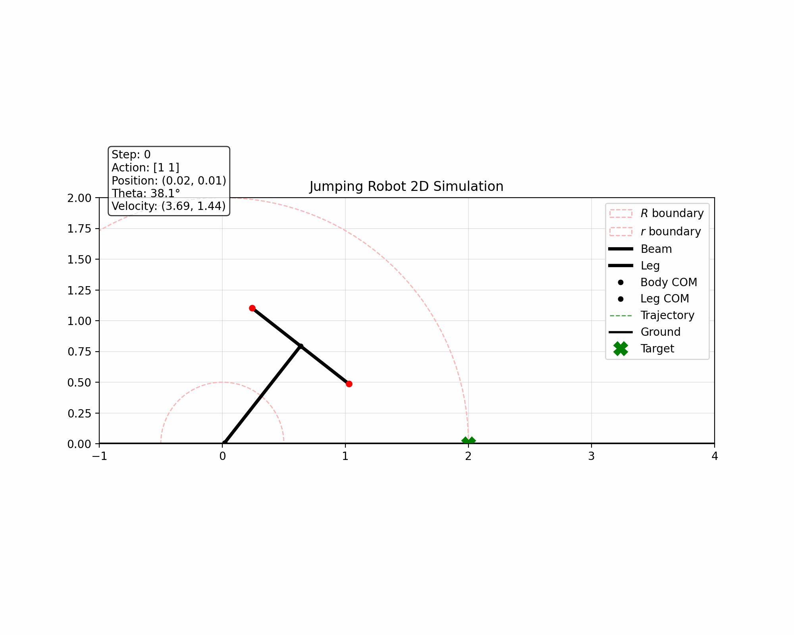
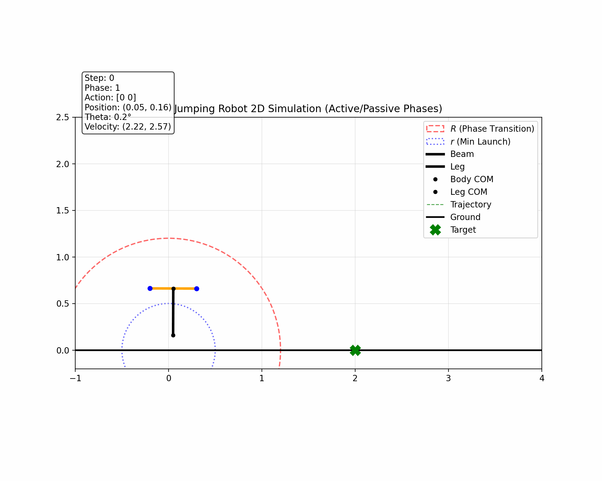

## Mission
We have a drone in 2D space with coordinate of $x_0$, and
$z_0$, and the velocity angle as $\theta_
0.$ What kind of
velocity should it have to reach the target position $x_{t1}$ and $z_{t1}$ passively considering gravity?
What kind of attack angle should the drone have when
touch ground, considering that there is a spring with
stiffness k and length l, in order to reach the next goal($x_{t2}$ and $z_{t2}$) following $x_{t1}$ and $z_{t1}$ passively?
In the meantime, the point has some rotational inertia as J. So what kind of angle and angular velocity should the
drone have to reach the attack angle in previous step?

The whole process can be seen as 

---

## Decision
1. We change our dimension to 6 []

2. The hopper may NOT land perfectly even if analytic formulas predict it. So we decide keep the lander reward for `pos_error`. 

3. Restraint condition:
- velocity to get the target basec on theta and the target point
$$v_0 = \sqrt{\frac{g(x_1-x_0)^2}{2cos^2 \theta_0((x_1-x_0)-(z_1-z_0))}}$$
- Time to target:
$$t^* = \frac{\Delta_X}{v_0cos\theta_0}$$

4. td is for touchdown

$$v_{req\_x} = \frac{\Delta x}{t^{*}}$$
$$v_{req\_y} = (\Delta z + 0.5 g (t^{*})^2) / t^*$$

5. Process Breakdown:
- Initial phase (Active): The robot is in a random state in the air. The model needs to control the thrust and torque to quickly adjust its position ($x, z$), velocity ($v$), and angle ($\theta$) to satisfy the "perfect ballistic formula".
- Once the state satisfies the formula ($v_{actual} \approx v_{req}$), the main thrust is turned off (Thrust=0), and the vehicle enters gliding mode.
- When approaching the target, we still need to turn on thrust to check the altitude.

6. Allows for fine-tuning of up to 20% of thrust out of $R^2$

## Advise Dec 11
1. PPO just control hopper to get the area ($r^2<pos<R^2$) and $30<angle<60$

## Prompt 
我们可以给个初始条件,例如dot_x0 dot_y0 还有出射角在一个范围内, 如这张图的一个过程,我们可以将[x_0,z_0,theta_0,v_0,omega_0,phi_0]作为初始条件,其中x_0,z0,theta_0, phi_0可以最为一个range.你理解一下这张图. 不过我更倾向于设置一个attack angle(target_theta) 为-20度,theta是leg的倾斜角,y正半轴顺时针为正.当hopper第一次跳跃,我们规定了一个扇形区域,这个扇形区域有几个约束条件:r^2<(x_0^2+y_0^2)< R^2 and (30< theta_0 < 60) and v_0=g*Δx^2/2/cos^2θ_0(Δx*tanθ_0-Δz) 需要满足位置姿态和速度条件才能保证你能到达第一个target. 因此,只要四足跳跃器获得此奖励，关闭控制，系统就会被动地到达 x_tar 和 y_tar. 当然,我们需要在最高点做一次姿态调整,让hopper到达target的时候姿态也正确. 当落地后,在落地后到第二次起飞前往第二个target的过程中,把落点 (x_t1, z_t1) 当作新的起点，把 (x_t2, z_t2) 当作新的目标。重复使用上面的弹道公式，当无人机以一定的初速度和位置触地（Touchdown），此时腿部与竖直方向形成一个初始攻击角 phi_td(target_theta)（相对于垂直方向，向左偏/后倾）。足端（Foot）在支撑期间视为通过摩擦力固定在地面，不滑动。
机体在重力和惯性作用下，绕足端进行倒立摆运动（顺时针旋转），同时腿部弹簧经历“压缩 -> 最短点 -> 伸长”的过程。

## 12.20 result
So first, we let PPO  find the conditional velocity which it can reach the target base on the equation:

$$v_0 = \sqrt{\frac{g(x_1-x_0)^2}{2cos^2 \theta_0((x_1-x_0)-(z_1-z_0))}}$$

Then, we add landing posture control, although he can get to the target robustly, but still have some problem in attitude control:

Then, we add a altitude condition tu let it change altitude automatically. I tried the Raibert control, but the result does not works well.

Then I was thinking whether i can first make a continues jumping based on the raibert control. Also I use Stble baseline3 (SB3) to train the model. Here 's the result from 
`Quadhopper12_23`.

`StopTrainingOnRewardThreshold`: Training will automatically stop when the specified reward threshold is reached.

`EvalCallback`: The model performance is evaluated periodically during training, and the best model is automatically saved.

`SubprocVecEnv`: Each environment runs in a separate subprocess.

 
