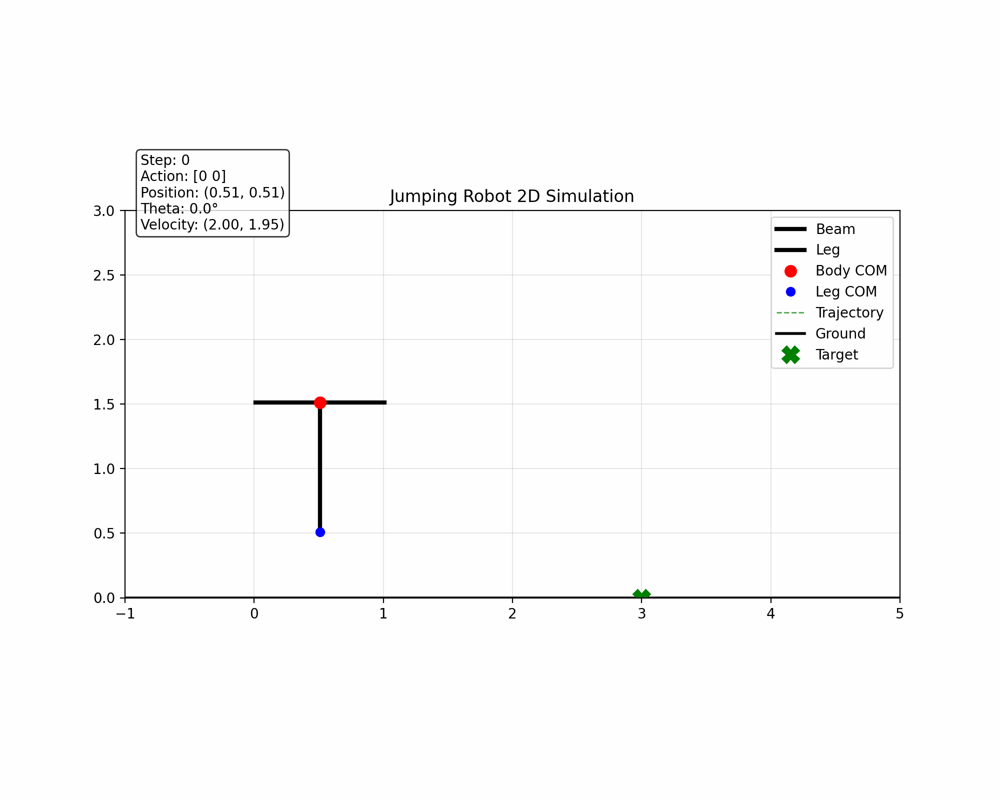

## PID + RL

First we use PPO algorithm to train the jumping robot to jumping to the target point with the target angle. 

Then i further improve the code by using **Fine-tuning** . It can continue training based on the current best model we have which save a lot of time to converge. Here’s my code. The context is we want the robot land at point (3,0) in the target angle 0°. Now it can get the target point in the target angle precisely. However, we can see it will cost mush energy.

现在用PID去跟随强化学习的点.先用强化学习仿真出一条完美的运动轨迹,再训练PID去跟随. 
dt = 0.05s, 先记录每隔0.05s的点的信息 $q(x,y,\theta)$, $q(dx,dy,d\theta)$. 

