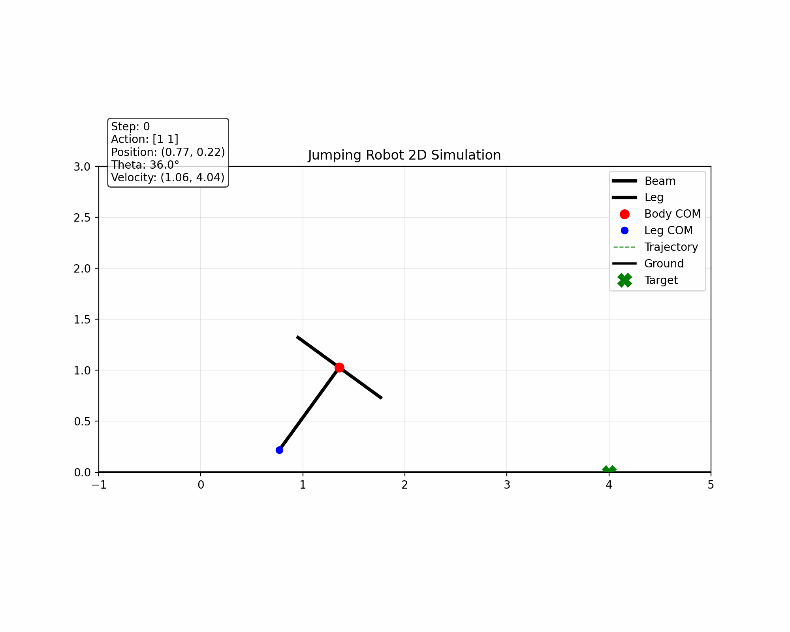

## PID + RL

first we use PPO algorithm to train the jumping robot to jumping to the target point with the target angle. 

现在用PID去跟随强化学习的点.先用强化学习仿真出一条完美的运动轨迹,再训练PID去跟随. 
dt = 0.05s, 先记录每隔0.05s的点的信息 $q(x,y,\theta)$, $q(dx,dy,d\theta)$. 

