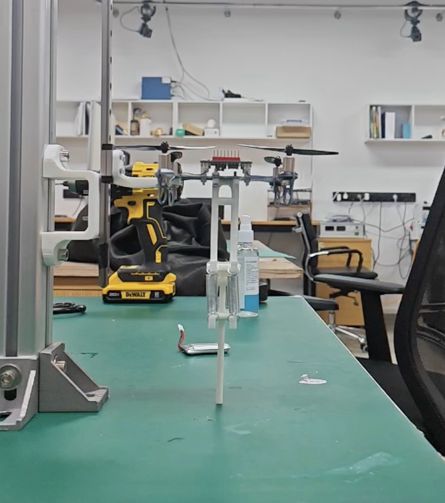
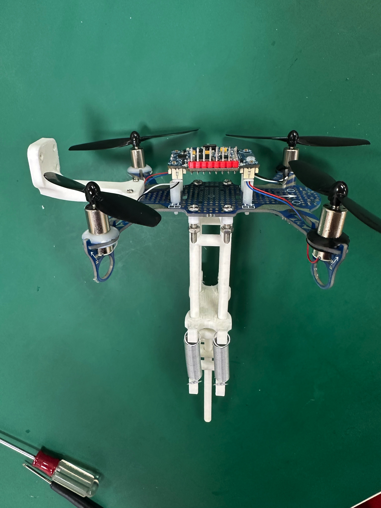
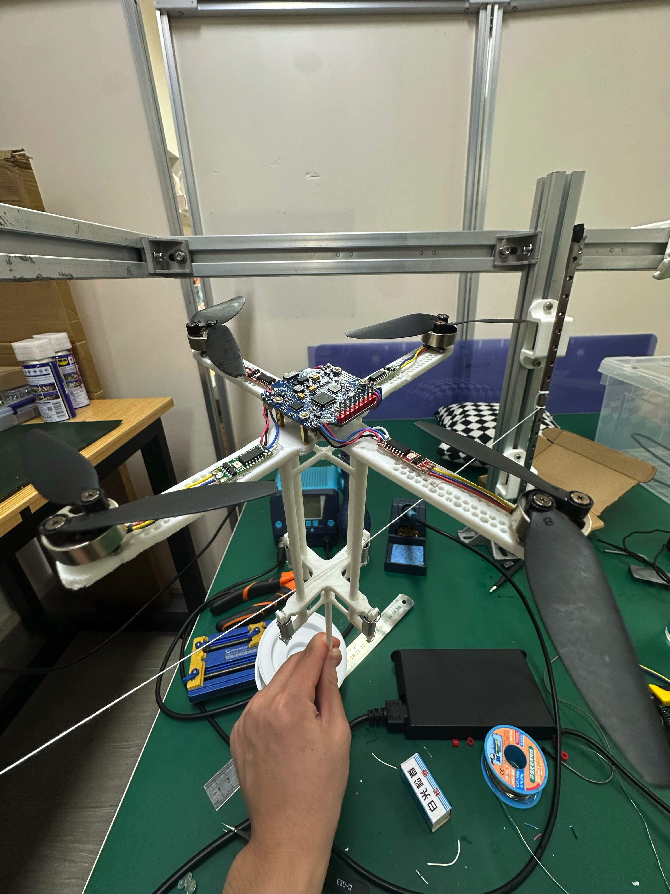

## Prototype v1:
Quadcopter drone based on stm32 and a spring leg structure

However in our test we found that the brushed motor of the quadcopter drone cannot drive the main body plus spring leg structure to take off smoothly.
Then we found that it's a good side for as to illustrate our robot. We periodically increase the power. The robot can use the elastic potential energy recovered from landing plus the energy provided by the drone to maintain the jumping state each time.

## Prototype v2:
We change the brushed motors to brushless motors and use bigger paddle. We also redesign the holistic quadcopter's frame (seen below).

