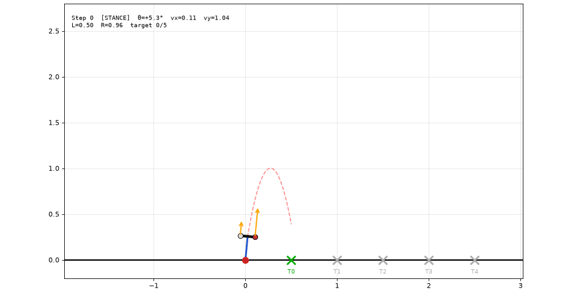
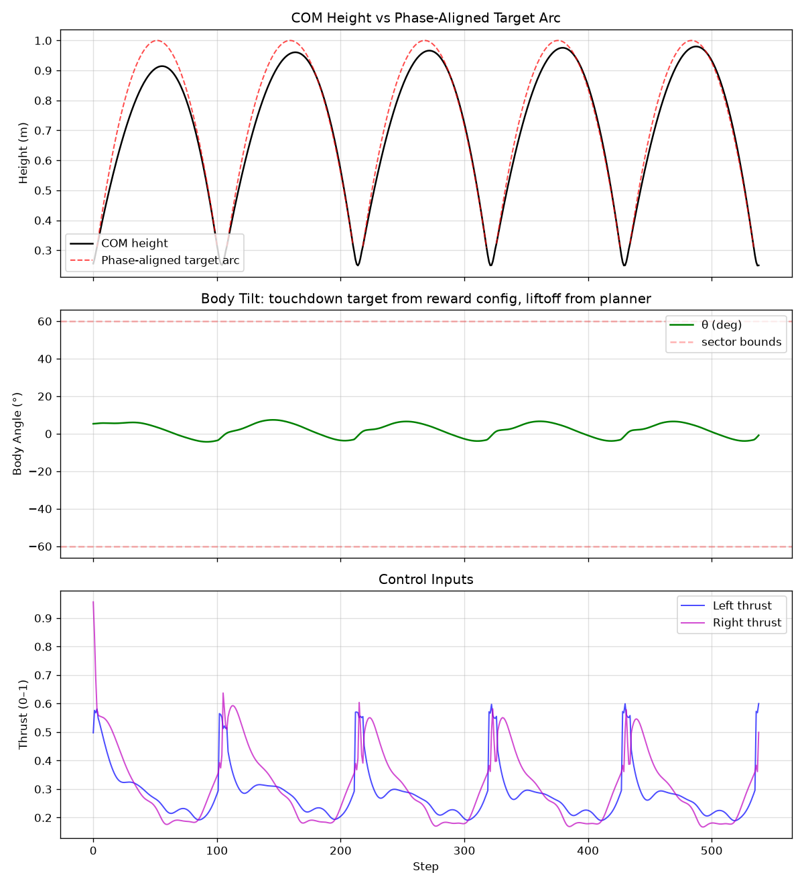
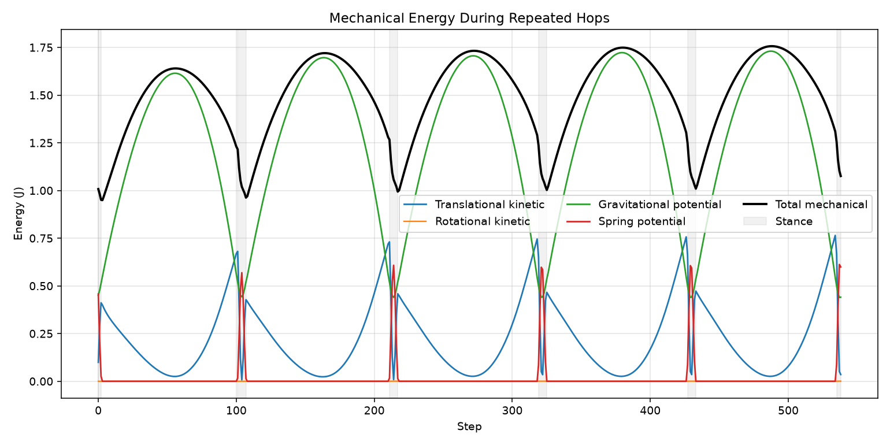
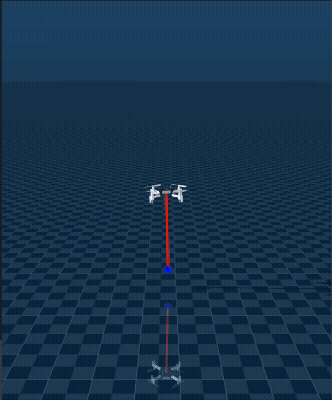
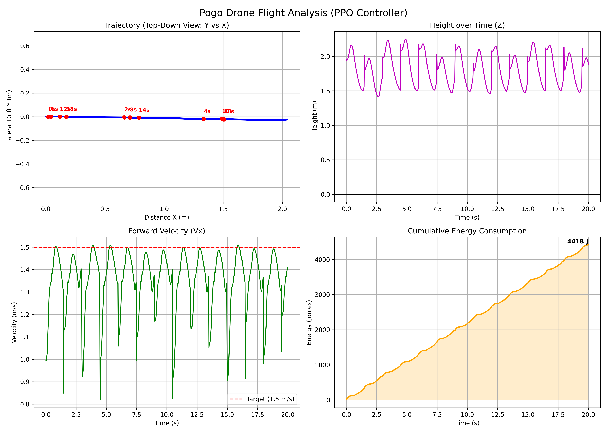
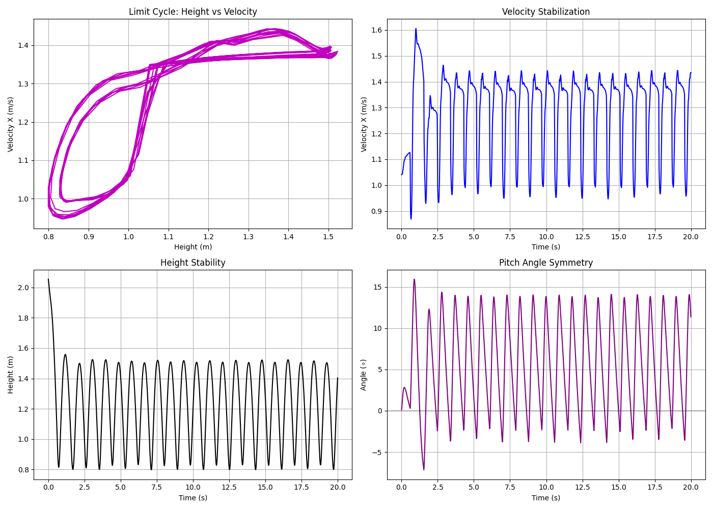

# RL-Based Control for Hybrid Hopper Dynamics

Reinforcement-learning control of an under-actuated **jumping robot** across a staged simulation pipeline. The project starts from a 2D **hybrid stance/flight dynamics** model for target hopping and energy-flow analysis, then explores early 3D MuJoCo variants, and is now being scaled up in **3D Isaac Sim** with thrust-driven actuation and domain randomisation for eventual sim-to-real transfer.

> **Latest milestone (May 2026):** Stable **in-place jumping** in Isaac Sim using PPO + restitution-based contact, with motor lag and per-environment physical-parameter randomisation. Policy keeps the body upright, holds horizontal position, and self-bounces from the ground without flying away.

---

## Method overview

### Problem framing
The robot's locomotion is a **hybrid dynamical system**: an actuated stance phase (when the foot/body contacts the ground and energy can be injected), followed by a **fully under-actuated ballistic flight phase** in which attitude must be stabilised before re-entry. Classical optimal-control approaches require accurate stance models and brittle mode transitions; we instead learn a single feedback policy that crosses both regimes.

### Algorithm
- **PPO** (Proximal Policy Optimisation) — clipped-objective actor-critic, on-policy
  - 2D hybrid dynamics / planar QuadHopper: Stable-Baselines3 and CUDA-native PyTorch rollouts
  - Early 3D MuJoCo experiments: Stable-Baselines3
  - Active 3D Isaac Sim experiments: **RSL-RL** with the Isaac Lab `DirectRLEnv` API
- Continuous action space, Gaussian policy
- GAE advantage estimation; entropy bonus annealed during training

### Isaac Sim environment (`HopperEnvCfg`)
| Field | Value | Note |
|---|---|---|
| `observation_space` | 26 | linear/angular vel, body quaternion, height, vz, planar position error, 3-step action history |
| `action_space` | 4 | normalised motor commands |
| Physics step | 5 ms (200 Hz) | high-frequency contact resolution |
| Policy step  | 10 ms (100 Hz) | decimation 2 |
| Episode length | 8 s | terminated early if the robot exceeds `max_hop_height = 0.4 m` |
| Parallel envs | 256 | RTX-class GPU |

### Actuation model
Each of the four motors is modelled with:
- **First-order lag**: `u_motor = α · u_target + (1 − α) · u_motor_prev`, with τ ≈ 15 ms
- **One-step action delay** to mimic command-to-thrust latency
- **Quadratic thrust curve** fit from bench data: `F(u) = −0.972 u² + 1.258 u − 0.058`, with linear extrapolation above the fit's validity range
- Per-rotor moment arm `L = 81.3 mm`, yaw torque `K_τ = 3 × 10⁻²`

### Domain randomisation (Isaac)
Sampled per environment and held fixed within an episode:
- Motor time constant
- Per-rotor thrust multiplier
- Yaw-torque multiplier
- Body mass multiplier
- Body inertia tensor multipliers
- Restitution-based bounce (material `restitution = 0.8`) — replaces an explicit spring joint and provides the impulsive ground reaction needed for hopping.

### Reward shaping
Dense reward composed of:

| Term | Weight | Purpose |
|---|---|---|
| `hop_velocity` | +8.0 | vertical velocity at low height (exp-decayed in `z`) |
| `ground_bonus` | +2.0 | encourages return to ground (prevents drifting up) |
| `xy_pos`       | +4.0 | hold ground-projected position near the spawn point |
| `survival`     | +0.5 | dense alive-bonus |
| `upright`      | −6.0 | quadratic tilt penalty |
| `xy_vel`       | −0.5 | horizontal-velocity damping |
| `action_rate` / `action_smooth` | −0.3 / −0.2 | first/second-difference penalties on the action stream |

---

## Results

### 2D hybrid dynamics QuadHopper

The planar QuadHopper can run its batched physics, rollout collection, GAE, and
PPO updates entirely on an NVIDIA GPU. From `Hopper_simu`, train a five-target
policy with:

```powershell
..\.venv\Scripts\python.exe -m Quadhopper.train --mode train --backend torch --device cuda --target-count 5 --timesteps 8000000 --model artifacts/models/ppo_quadhopper_v7_cuda_five_hop
```

Evaluate 512 parallel five-hop episodes before rendering a deterministic
rollout:

```powershell
..\.venv\Scripts\python.exe -m Quadhopper.train --mode eval --backend torch --device cuda --target-count 5 --episodes 512 --model artifacts/models/ppo_quadhopper_v7_cuda_five_hop
..\.venv\Scripts\python.exe -m Quadhopper.train --mode test --backend torch --device cuda --target-count 5 --test-steps 800 --model artifacts/models/ppo_quadhopper_v7_cuda_five_hop
```

The test command writes the animation, trajectory/thrust analysis, and
mechanical-energy breakdown to `artifacts/renders/`. On machines without CUDA,
keep the original Stable-Baselines3 path by selecting
`--backend sb3 --device cpu`; `--backend auto` chooses the CUDA-native backend
only when CUDA is available.

Five-hop rollout from the planar QuadHopper target-jumping task:



The controller produces repeated stance-flight cycles with phase-aligned height
tracking near the 1 m target arc and bounded body pitch:

| Phase-aligned height / pitch / thrust | Mechanical energy over repeated hops |
|---|---|
|  |  |

### Early 3D MuJoCo hopper variants

Earlier milestone — PPO policy that times its release for an energy-efficient
ballistic jump and stabilises landing attitude:



Energy and limit-cycle diagnostics during the ballistic-launch experiments:

| PPO energy use | PPO limit cycle |
|---|---|
|  |  |

### 3D quad-rotor hopper (Isaac Sim, RSL-RL)

> *Placeholder — GIF to be added.* Path will be `docs/images/isaac-hopper-jump.gif`.

Currently achieved:
- Stable **in-place repeated jumping** with the body remaining upright (tilt < ~5°)
- Position-holding within ~0.1 m of the spawn point over an 8 s episode
- Trained from scratch with 256 parallel envs

Next steps:
- Add disturbance rejection (push recovery)
- Forward / directional hopping
- Sim-to-real transfer to the physical platform

---

## Repository layout

```
Jumping-Robot/
├── Hopper-sim-Isaac/        # 3D Isaac Sim + RSL-RL PPO (active)
│   ├── Quadhopper_Isaac/    # env package: HopperEnvCfg, motor/thrust model, PPO cfg
│   ├── train.py / play.py   # training & rollout entry points
│   └── run_train.sh         # local Isaac Sim launcher
├── Hopper_simu/             # 2D planar hybrid-dynamics QuadHopper experiments
├── model-free-mujoco-RL/    # MuJoCo Quadhopper variants (fixed-point, vertical jump, etc.)
├── Jumping-Robot-Obd/       # earlier on-board / hardware-side notes
├── legacy-ppo-baseline/     # earliest working PPO Actor-Critic
└── docs/                    # README assets, meeting notes
```

## Stack

- **Physics**: 2D hybrid dynamics, MuJoCo variants, Isaac Sim 5.1 (Isaac Lab `DirectRLEnv`)
- **RL**: Stable-Baselines3 / CUDA-native PyTorch PPO (2D), RSL-RL PPO (Isaac)
- **Tooling**: PyTorch, gymnasium, TensorBoard

---

*Personal research log — happy to walk through the methods or share trained weights on request.*
